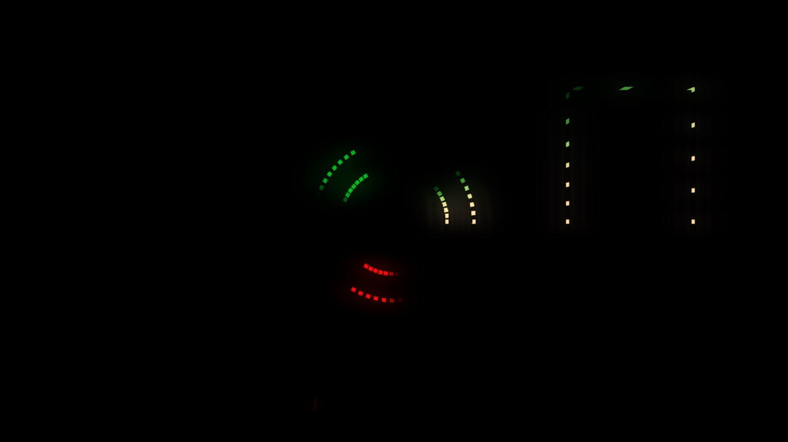
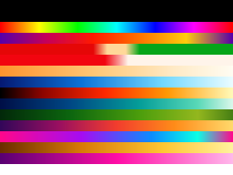
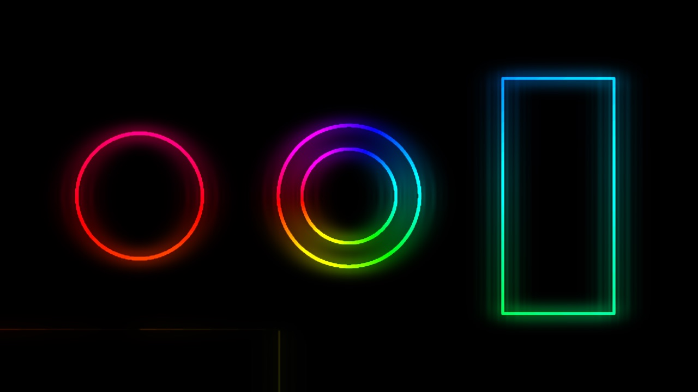
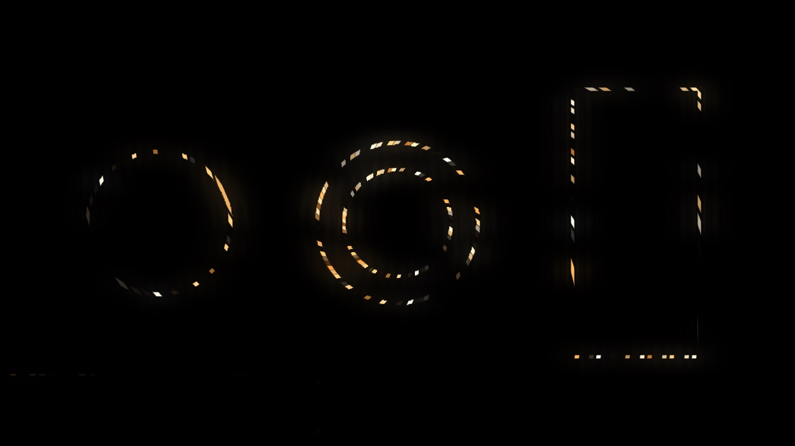
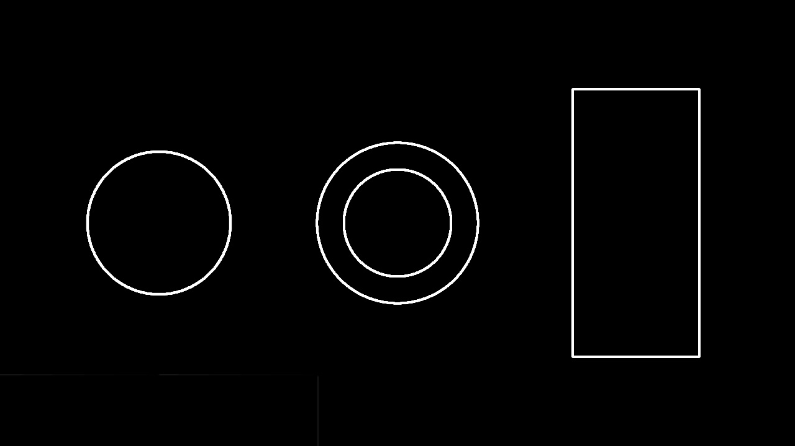

# Tinsel

> **AI-assisted project.** This codebase was created with [Claude](https://claude.com/claude-code)
> (Anthropic), directed and reviewed by a human author. The pattern library is
> verified numerically by an offline harness that drives the real plugin class in
> a headless GL context: it renders the shader at one pixel per lamp and compares
> the readback against an independent C++ implementation — **527,100 comparisons
> with zero disagreements** (see [Status](#status)). It has **never been loaded
> into Resolume** — only compiled, rendered and measured offline. Check it in
> your own rig before trusting it in a show.

Finds the outlines in a clip and lights them like a string of LEDs, as an FFGL
effect for [Resolume](https://resolume.com) Arena and Avenue. Point it at a logo
and it becomes a neon sign, a theatre marquee, or a Christmas tree.



<sub>The repo's test card with a chase running round the detected outlines.
Rendered by `tinseltest`, the offline harness.</sub>

## An effect never chooses a colour

That is the whole design, and everything else follows from it.

A pattern answers two questions about one lamp — **where in the palette** it
sits, and **how bright** it is. The palette turns the first of those into RGB.
It is how an LED controller is built, and it is why twenty patterns and sixteen
palettes are worth more than thirty-six of either: Comet on **Christmas** is a
red-and-green chaser, Comet on **Frost** is a shooting star, and neither is the
other wearing a hat.

It also means a pattern is a pure function of *(lamp, time)* — no state, no
history — which is what makes it testable. The library exists twice, once in
C++ and once in GLSL, and the harness proves they agree.

**Twenty patterns:** Solid, Gradient, Rainbow, Colour Loop, Chase, Theater
Chase, Running Lights, Comet, Meteor, Larson Scanner, Colour Wipe, Twinkle,
Sparkle, Glitter, Fire Flicker, Breathe, Strobe, Dissolve, Colorwaves, Fairy
Lights.

**Sixteen palettes:** Colour 1, Colour 1 > 2, Rainbow, Party, Christmas, Candy
Cane, Warm White, Frost, Fire, Ocean, Forest, Sunset, Cyberpunk, Gold, Magenta,
Mono.



<sub>The baked palette table. The top two rows are black because they are drawn
from the Colour 1 and Colour 2 controls rather than from the table.</sub>

The palettes are **authored here, not imported.** WLED is EUPL-1.2 and FastLED's
gradient palettes carry cpt-city's own terms; neither is MIT and this repo is.
Nothing was copied from either — the patterns are implemented from a description
of what each one does.

## Lamps or rope, from one control



Lamp Size is a radius **in pixels**. Wind it up past half the lamp spacing and
the lamps run into each other and the strip becomes a continuous rope — the
neon-sign look, from the same control rather than a second mode.



Wind it down and you get discrete bulbs with gaps between them.

## Finding the outline



**Detect On** picks what "different" means between two pixels, and the choice
matters more than the operator does:

- **Luma** — ordinary brightness edges.
- **Alpha** — for a logo delivered with transparency, which already has a
  perfect outline in its alpha channel.
- **Chroma** — the boundary between two colours of *equal brightness*, which a
  luma edge detector is completely blind to and which brand artwork is full of.
- **Luma or Alpha** — both, for artwork that could arrive either way.

**Detail** runs the operator at a coarser scale, so it finds the shape of a logo
rather than the texture inside it. **Stability** is a temporal filter for
footage — deliberately asymmetric, rising almost instantly and falling slowly,
because what goes wrong on video is not that edges move but that they drop out
for a frame and the lamp blinks.

**Background → Edges** shows the mask on its own, which is how Sensitivity,
Detail and Thickness are actually set — judging a threshold through a layer of
lamps and glow is guesswork.

## What this release does not do

The strip coordinate is a **field**, not an arc length. The plugin computes a
scalar for every pixel — a spiral about the artwork's centroid by default —
quantises it into lamps, and runs the patterns on that. It does not trace the
contour.

So a chase **climbs the shape the way a string wound round a tree climbs it**,
which is the intended look and is faithful to what a real strip does. But it is
**not** a chase that follows the letterform of an `S` round its own curve, and
separate parts of a shape are not wired in series.

Contour tracing is planned for v0.2. The controls are already the ones it needs.

## Build

Needs CMake and the Resolume FFGL SDK, which is a submodule.

```bash
git clone --recursive https://github.com/stoatworks-labs/tinsel
cd tinsel
cmake -B build -DCMAKE_BUILD_TYPE=Release
cmake --build build
cmake --install build    # → ~/Documents/Resolume Arena/Extra Effects
```

macOS builds universal (arm64 + x86_64) by default. Add
`-DCMAKE_OSX_ARCHITECTURES=arm64` for a faster development build.

macOS will refuse to load the unsigned bundle until it is unquarantined — see
[docs/UNSIGNED.md](docs/UNSIGNED.md).

## Status

Verified by measurement on an M4 Max, macOS 26.4:

| Check | Result |
| --- | --- |
| GLSL patterns vs C++ patterns | 20 patterns × 7 times × 5 intensities × 3 spreads × 251 lamps — **527,100 comparisons, 0 disagreements** |
| No dead controls | all **31** parameters measurably change the picture |
| Palette table | 16 rows, correct order, correct endpoints |
| macOS binary | universal (`x86_64 arm64`), exports `plugMain` |

Run it yourself with `tools/verify.sh`.

**Not yet done:** never loaded into Resolume, never built on Windows or Linux,
nothing timed. See [AGENTS.md](AGENTS.md) for the full list of what is assumed
rather than measured, and for the traps.

## Licence

MIT — see [LICENSE](LICENSE).
